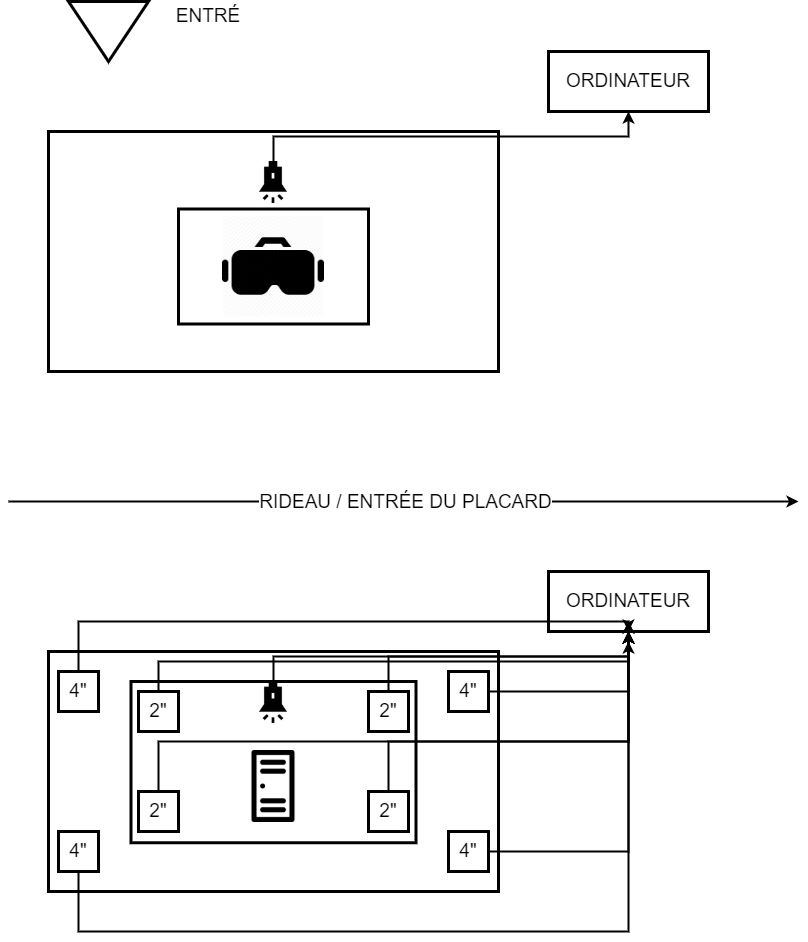

### Réalisé par:
- Naoufal Bensaiad
- Jérémie Lévesque
- Samuel Poulin

### Synopsis:
Tu arrive dans une gymnase et tu joue au ballon chasseur tu t'amuse a toucher le plus de personne possible avec le ballon et après le compteur de trois minutes le jeu s'arrête.

Tu es enfermé dans un casier sombre et glacial pour une énième fois cette année le temps te paraît une éternité des rires moqueurs, ta respiration devient de plus en plus insupportable, l'angoisse commence à prendre le dessus 3 minutes devient un long moment interminable.

### L'ambiance:
L'ambiance de cette oeuvre exprime la joie et le bonheur mais aussi de la solitude et de la dépresssion par rapport à chaque partie de l'oeuvre.

### L'installation dans le studio:

### Schéma de l'installation prévue:

>Source [Page plantation](https://tim-montmorency.com/2022/projets/3-minutes/docs/web/preproduction.html)

### Comment le thème du temps est exploité:
Dans cette oeuvre, le temps est utilisé comme une limite de temps pour effectuer une tache comme par exemple, lancer le plus de ballons possible dans une cible. La notion du temps dans cette oeuvre est différente à chaque trois minutes.

### But de l'interacteur.trice:
L'interacteur.trice doit en premier lancer des ballons sur des cibles en 3 minutes. Ensuite, il faut aller dans un couloir sombre pour aller après dans un casier.

### 3 cours incontournables:
- Réalité virtuelle
- Conception de projet multimédia
- Gestion de projet multimédia

### Technique inconnue:
- Model 3d

### Composante technologique:
- Kinect
