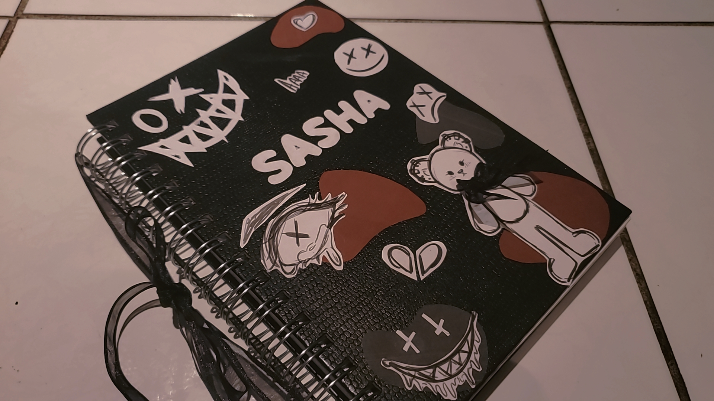
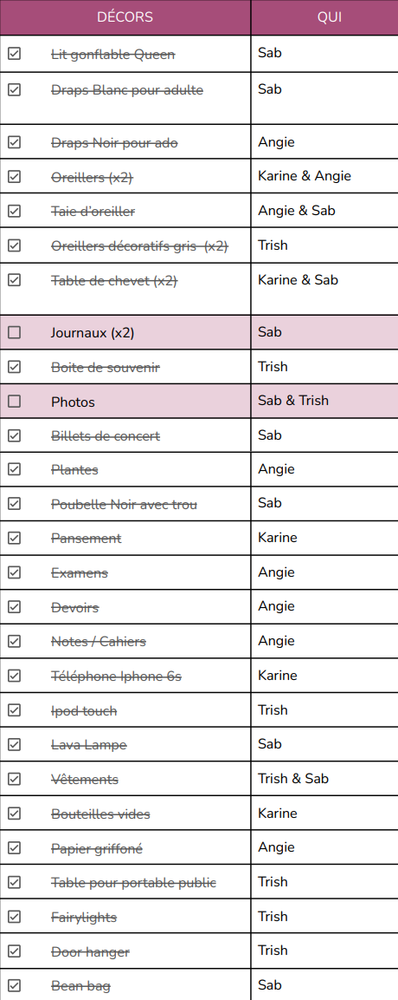

# Analyse de l'oeuvre

**Membres de l'équipe**: Trish Nguyen, Angelina De Silva Jeca, Karine Cornier et Sabrina Kayani.

Synopsis: *«Sasha adolescente et Sasha adulte vivent leur vie. Durant son adolescence, Sasha se fait négliger par ses parents et cela affecte sa santé mentale. Pendant sa vie d'adulte, Sasha habite maintenant seule, Sasha s'accepte, mais ses parents sont toujours contre elle. Cependant, Sasha se porte mieux mentalement qu'avant. Le public est appelé à découvrir que les deux vies projetées devant eux sont différents passages de la vie d'une seule et même personne.»*

>source: [page de l'équipe](https://tim-montmorency.com/2022/projets/Chere-Sasha/docs/web/index.html)

## Utilisation du thème

Le thème du temps est utilisé dans ce projet avec les deux moments de la vie du personnage principal, l'un étant pendant son adolescence et l'autre des années après lorsqu'elle est une adulte.

## Expérience vécue par l'interacteur

L'interacteur est appelé à participer à une expérience interactive dans laquelle il se situe dans la chambre de Sasha, une fille faisant parti de la communautée LGBTQ+ à deux moments de sa vie. Ces deux moments sont lorsqu'elle est une jeune adolescente qui se sent comme si tout le monde est contre elle et ensuite, lorsqu'elle, un moment où sa vie va beaucoup mieux. La chambre change d'ambience visuelle et sonore dépendement de l'étape de la vie de Sacha. Les personnages présents dans l'histoire parlent. L'interacteur peut intéragir avec un téléphone cellulaire appartenant à Sasha sur lequel il recevra des messages et appels. Il peut également lire son journal.

>Journal de Sasha

## Ambience

*Chère Sasha* possède deux ambiences distinctes, l'une pour la partie adolescente, qui est déprimante avec une bande sonore ambiante incluant des pleurs. La salle est aussi très peu éclairée. Cela donne l'illusion d'être isolé dans cette salle, dans une situation qui n'est pas agréable. Ensuite, La partie adulte, qui ne contient plus de ces genre de bruits, plutôt, il y a les bruits d'une ville en action comme des voitures passant sur une route, il y a beaucoup plus de lumière ce qui donne un effet de confiance, on peut sentir que malgré ce qu'il s'est passé pendant son adolescence, Sasha a repris le contrôle de sa vie.

## Décor de la chambre

La chambre de Sacha contiens plusieurs éléments de décor, voici une liste venant de la [page de l'équipe](https://tim-montmorency.com/2022/projets/Chere-Sasha/docs/web/index.html):

>source: [page de l'équipe](https://tim-montmorency.com/2022/projets/Chere-Sasha/docs/web/index.html)

## Installation et schéma

L'oeuvre sera situé dans deux salles contenant chacunes les éléments du stade de la vie de Sasha.

>source: [préproduction de l'équipe](https://tim-montmorency.com/2022/projets/Chere-Sasha/docs/web/preproduction.html)

**Schéma de branchement:**

>source: [préproduction de l'équipe](https://tim-montmorency.com/2022/projets/Chere-Sasha/docs/web/preproduction.html)

## Cours lié au projet

Le projet utilise entre autre des techniques apprises dans les cours de web, animation 2D et espace interactif.
