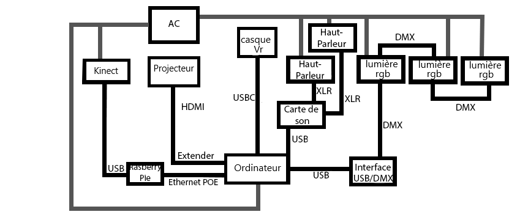

# Distortion Collective

**Synopsis**:*«L’expérience commence par la perspective d’un élève qui va commencer ses premiers cours en ligne durant le confinement avec enthousiasme. Les complications commencent à partir du moment où le professeur se présente, que les travaux s’accumulent, que la personne vit un sentiment d’isolement, et le tout dans une boucle sans fin qui s’accélère périodiquement et qui l’affecte mentalement. Une expérience sur des sensations réelles qui vous fera réfléchir.»*

>source: [page de l'équipe](https://tim-montmorency.com/2022/projets/Distorsion-collective/docs/web/index.html)

**Membres de l'équipe**: William Dubois et Ghislain Lacombe

## Utilisation du thème

Le thème du temps est utilisé dans cette oeuvre en utilisant la perte du fil du temps que nous avons resenti pendant le confinement, pendant ce moment ou tout les jours se ressemblaient.

## Expérience utilisateur

L'interacteur entre dans une salle de couleur bleu pâle. Sur un mur, on peut voir une conversation entre deux étudiants parlant d'une semaine sans école. On apprend aussi que les cours en ligne vont bientôt débuter, donnant ainsi le contexte du confinement à cause de la pandémie de covid-19. La suite de l'expérience se passe en vr. L'interacteur assiste à une scène qui va se répéter sans cesse, celui d'une journée avec des cours en ligne. Après un certain nombre de boucles, on peut commencer à voir du changement, la voix du professeur devient robotique, des feuilles de travaille se remplissent. À la fin de la séquence, on peut voir les autres étudiants se déconnecter du cours. L'interacteur peut lui aussi se déconnecter. Ce qui met fin au chaos. Laissant comme seule chose visible le portable.

## Ambiance

L'ambiance de l'oeuvre commence très calme et appaisante. Alors que l'étudiant ne sais pas encore ce qui est pour arriver. Pour ensuite lentement laisser place à quelque chose d'angoissant et chaotique au fil du temps.

>source: [préproduction de l'équipe](https://tim-montmorency.com/2022/projets/Distorsion-collective/docs/web/preproduction.html)

## Installation et schéma

L'installation de cet oeuvre requis:1 projecteur, 2 haut parleurs un bureau, une chaise et un casque vr. La majorité du projet ce passe dans le casque avec un environement 3D complètement modélisé

Voici l'installation de l'oeuvre:

>source: [préproduction de l'équipe](https://tim-montmorency.com/2022/projets/Distorsion-collective/docs/web/preproduction.html)

Voici le schéma de branchement de l'oeuvre:

>source: [préproduction de l'équipe](https://tim-montmorency.com/2022/projets/Distorsion-collective/docs/web/preproduction.html)

## Cours utilisés pour la création de cette oeuvre

Cette oeuvre utilise notament les techniques apprises dans les cours suivants: *modélisation 3D, conception sonore, animation 3D.*

