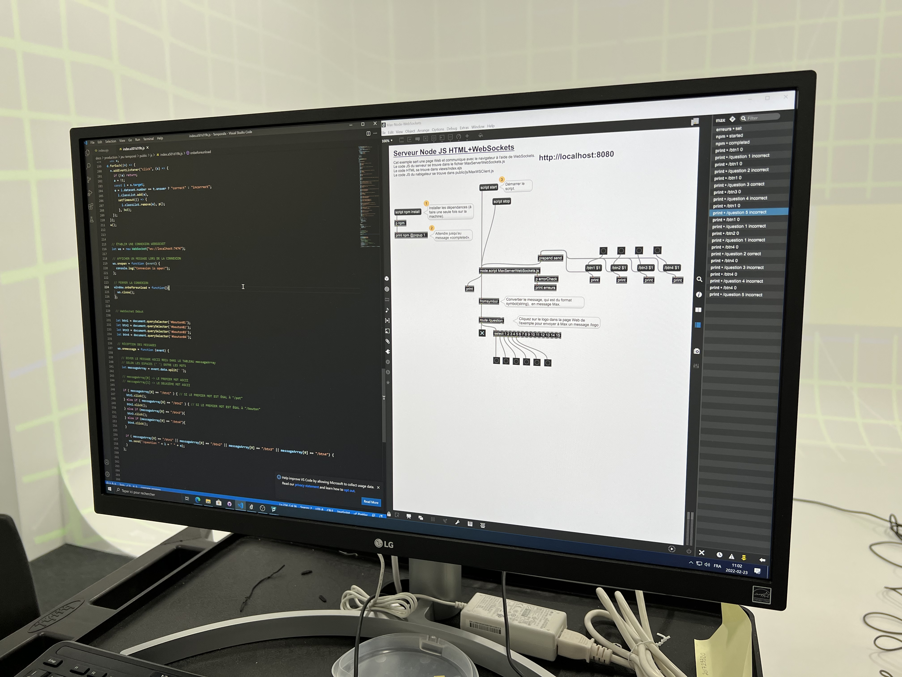
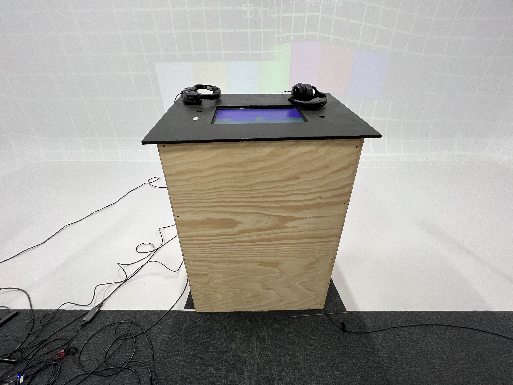

### Réalisé par:
- Raphaël Fillion
- Philippe Trudel

### Synopsis:
Nous souhaitons sensibiliser la génération actuelle sur les conséquences écologiques de nos actions pour le futur. Nous voulons également que notre expérience puisse faire réagir l'utilisateur sur l'importance de l'environnement et susciter son action. Une personne est invité à faire une expérience intéractive sur le sujet de l'environnement et changements climatique. Cette personne entre dans le jeu télévisé fictif Jeu Temporel pour montrer son talent, mais le jeu s'avère être une critique du mode de vie de notre époque et d'un cri d'alarme pour le future qui s'en vient. Plusieurs fins différentes peuvent arriver et le joueur, et ses choix, peut réussir à vivre une fin heureuse ou désastreuse.

>Source: [page de l'équipe](https://tim-montmorency.com/2022/projets/Jeu-Temporel/docs/web/index.html)

### Comment le thème du temps est exploité:
À chaque question répondue, le temps de réponse est réduit et les questions deviennent sérieuses, donc le joueur n'a pas le temps de réfléchir et doit faire des choix rapidement. À la fin, les choix faits par le joueur décident de ce que sera le futur.

### L'ambiance:
L'ambiance de cette oeuvre est inspiré de jeux télévisés. Donc, il y a une musique agréable et la situation est joyeuse. Cela ressemble à une fête. La personne 
qui joue à ce jeu va avoir des attentes uniques par rapport au jeu. Par contre, l'ambiance change pendant le jeu. L'animateur change d'apparence pendant toute l'expérience. 

### L'installation dans le studio: 

- Cette oeuvre requiert l'installation de projecteurs et d'haut-parleurs.

>Source: [Page de projet](https://tim-montmorency.com/2022/projets/Jeu-Temporel/docs/web/index.html)

- Elle requiert aussi un écran de télévision pour le codage.

>Source: [Page de projet](https://tim-montmorency.com/2022/projets/Jeu-Temporel/docs/web/index.html)

- Il faut avoir un podium pour mettre l'écran tactile nécessaire pour jouer.

>Source: [Page de projet](https://tim-montmorency.com/2022/projets/Jeu-Temporel/docs/web/index.html)

### Schéma de l'installation prévue:

>Source: [Page de préproduction](https://tim-montmorency.com/2022/projets/Jeu-Temporel/docs/web/preproduction.html)

### Le but de L'interacteur.trice:
Dans le jeu, le joueur n'a seulement besoin de participer en répondant aux questions de l'animateur. À la fin, le joueur découvre s'il sauve ou il ruine la Terre.

### Les 3 cours requis:
- Introduction à la programmation multimédia
- Animation 2d
- Espace interactif

