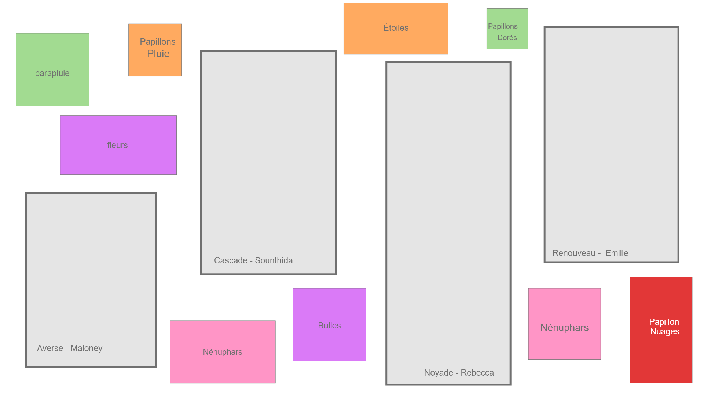

# Le Musée de la Vie / Chronaufrage

Certaines informations sont tirées du [github du projet](https://github.com/Blobduckies/Chronaufrage).

Certaines images sont tirées de la [page de présentation du projet](https://tim-montmorency.com/2022/projets/Chronaufrage/docs/web/index.html)

## Le Musée de la Vie est réalisé par:
Maloney Khim, Southida Kong, Olivier Lalonde, Rebecca Pilotte, Émilie Fontaine

## Exploitation du thème *Temps* dans le projet:
Le thème temps a été interprété en tant que météo, donc chaque cadre a une météo différente

## Ambiance:
L'ambiance change de cadre en cadre
- Premier cadre: Averse. Beaucoup de pluie, une ambiance monotone
- Deuxième cadre: Cascade. Sentiment d'impuissance et de stress. Environnement sortant tout droit d'une oeuvre d'art
- Troisième cadre:  Noyade. Tristesse et déception. Environnement calme et sombre
- Quatrième cadre: Renouveau. relaxation. Environnement calme et reposant, eau qui coule et papillons qui volent

## Installation en cours
- quatre grands cadres blancs qui servent de surface de projection pour les animations
- neuf petits cadres pour projeter des animations en boucle pour complémenter les quatre cadres principaux

</img>
